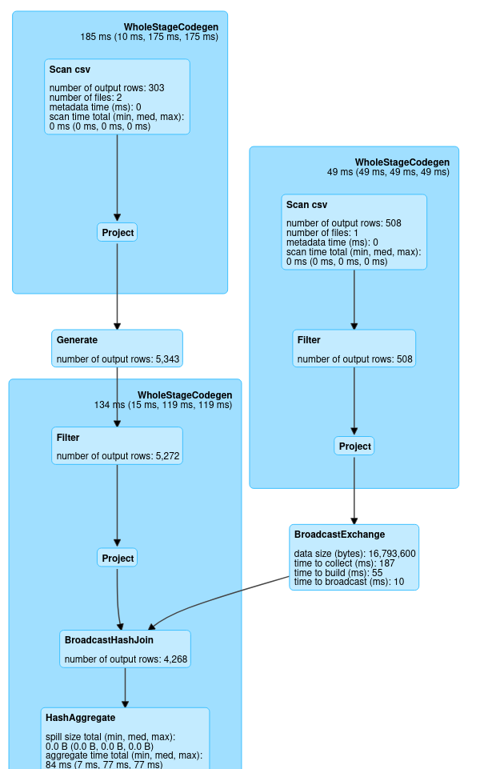

# Практическое задание


#### 1. Какая связь между DataFrame и Dataset? (1 балл)
DataFrame является алиасом для DataSet<Row>
#### 2. Соберите WordCount приложение, запустите на датасете ppkm_sentiment (1 балл)
#### 3. Измените WordCount так, чтобы он удалял знаки препинания и приводил все слова к единому регистру (2 балла)
#### 4. Измените выход WordCount так, чтобы сортировка была по количеству повторений, а список слов был во втором столбце, а не в первом (1 балл)
#### 5. Добавьте в WordCount возможность через конфигурацию задать список стоп-слов, которые будут отфильтрованы во время работы приложения (2 балла)
```sh
sbt package
sudo docker cp /home/nikita/IdeaProjects/ML_Homework_4.git/target/scala-2.11/ml_homework_4_2.11-0.1.0-SNAPSHOT.jar  0fa82b0b1f16:/home/hduser/

spark-submit --class com.dergunov.homework.WordCount --master yarn --deploy-mode cluster ml_homework_4_2.11-0.1.0-SNAPSHOT.jar
#без фильтрации (первый запуск):
hdfs dfs -ls /user/hduser/spark2/ppkm_out/
Found 201 items
....
-rw-r--r--   1 hduser supergroup        122 2022-10-23 23:59 /user/hduser/spark_wit_exqwe/ppkm_out/part-00193-709c6ba3-43a5-4d03-b152-e793ea8e9cd3-c000.csv
-rw-r--r--   1 hduser supergroup        130 2022-10-23 23:59 /user/hduser/spark_wit_exqwe/ppkm_out/part-00194-709c6ba3-43a5-4d03-b152-e793ea8e9cd3-c000.csv
-rw-r--r--   1 hduser supergroup        102 2022-10-23 23:59 /user/hduser/spark_wit_exqwe/ppkm_out/part-00195-709c6ba3-43a5-4d03-b152-e793ea8e9cd3-c000.csv
-rw-r--r--   1 hduser supergroup        139 2022-10-23 23:59 /user/hduser/spark_wit_exqwe/ppkm_out/part-00196-709c6ba3-43a5-4d03-b152-e793ea8e9cd3-c000.csv
-rw-r--r--   1 hduser supergroup        172 2022-10-23 23:59 /user/hduser/spark_wit_exqwe/ppkm_out/part-00197-709c6ba3-43a5-4d03-b152-e793ea8e9cd3-c000.csv
-rw-r--r--   1 hduser supergroup        105 2022-10-23 23:59 /user/hduser/spark_wit_exqwe/ppkm_out/part-00198-709c6ba3-43a5-4d03-b152-e793ea8e9cd3-c000.csv
-rw-r--r--   1 hduser supergroup        137 2022-10-23 23:59 /user/hduser/spark_wit_exqwe/ppkm_out/part-00199-709c6ba3-43a5-4d03-b152-e793ea8e9cd3-c000.csv


# с фильтрацией
hdfs dfs -ls /user/hduser/spark2/ppkm_out/
Found 2 items
-rw-r--r--   1 hduser supergroup          0 2022-10-23 23:37 /user/hduser/spark2/ppkm_out/_SUCCESS
-rw-r--r--   1 hduser supergroup      17592 2022-10-23 23:37 /user/hduser/spark2/ppkm_out/part-00000-8c4f81f8-30ea-42b8-96f1-dea848e5cc05-c000.csv

```

```scala
package com.dergunov.homework

import org.apache.spark.sql.{DataFrame, SparkSession, functions}
import org.apache.spark.sql.functions.{concat_ws, explode}
import org.apache.spark.sql.types.{StringType, StructField, StructType}

import scala.language.postfixOps

object WordCount {
  def main(args : Array[String]): Unit = {
    val spark: SparkSession = SparkSession.builder()
      .appName("Spark data frame words count")
      .getOrCreate()

    val conf = spark.sparkContext.getConf
    val sqlContext = spark.sqlContext;

    val inputPath = conf.get(Config.IN_PATH_PARAM, Config.IN_PATH_DEFAULT)
    val outputPath = conf.get(Config.OUT_PATH_PARAM, Config.OUT_PATH_DEFAULT)

    val stopWordsStrPath = conf.get(Config.STOP_WORDS_PARAM, Config.STOP_WORDS_DEFAULT)

    import spark.sqlContext.implicits._


    val dfStopWords: DataFrame = getDfStopWords(spark, stopWordsStrPath)

    sqlContext.read
      .option("header", "true")
      .csv(inputPath)
      .select(concat_ws(" ", $"class", $"comment") as "docs")
      .select(functions.split($"docs", "\\s") as "words")
      .select(explode($"words") as "word")
      .select(functions.trim($"word") as "word")
      .select(functions.regexp_replace($"word", "[.,;:\"()!?-]", "") as "word")
      .select(functions.lower($"word") as "word")
      .filter(!($"word" === ""))
      .except(dfStopWords)
      .groupBy($"word")
      .count()
      .select($"count", $"word")
      .orderBy($"count")
      .write.mode("overwrite")
      .csv(outputPath)

    spark.stop()
  }

  private def getDfStopWords(spark: SparkSession, stopWordsStrPath: String): DataFrame = {
    import spark.sqlContext.implicits._

    val customSchema = StructType(Array(StructField("word", StringType, nullable = true)))

    spark.sqlContext.read
      .schema(customSchema)
      .csv(stopWordsStrPath)
      .select(functions.lower($"word") as "word")
      .select(implicitly($"word"))
      .filter(!($"word" === ""))
  }

  object Config {
    val IN_PATH_PARAM: String = "scala.word.count.input"
    val IN_PATH_DEFAULT: String = "/user/hduser/ppkm/*.csv"

    val OUT_PATH_PARAM: String = "scala.word.count.output"
    val OUT_PATH_DEFAULT: String = "/user/hduser/spark2/ppkm_out"

    val STOP_WORDS_PARAM = "scala.word.count.stop.words"
    val STOP_WORDS_DEFAULT = "/user/hduser/ppkm/stopwordv1.txt"
  }
}

```
#### 6. Почему в примере в выходном файле получилось 200 партиций? (3 балла)

| С фильтрацией по стоп словам    | Первый запуск (2 пункт) |
|---------------------------------|-------------------------|
|   |      |

Без фильтрации стоп словам функция HashAggregate распределяет данные по партициям (200) 
[configuration spark.sql.shuffle.partitions which is by default set to 200.](https://sparkbyexamples.com/spark/spark-shuffle-partitions/)
, каждая из которых может обрабатываться отдельно, однако при фильтрации нужно проверить все слова и необходимо 
это сделать на одной партиции
